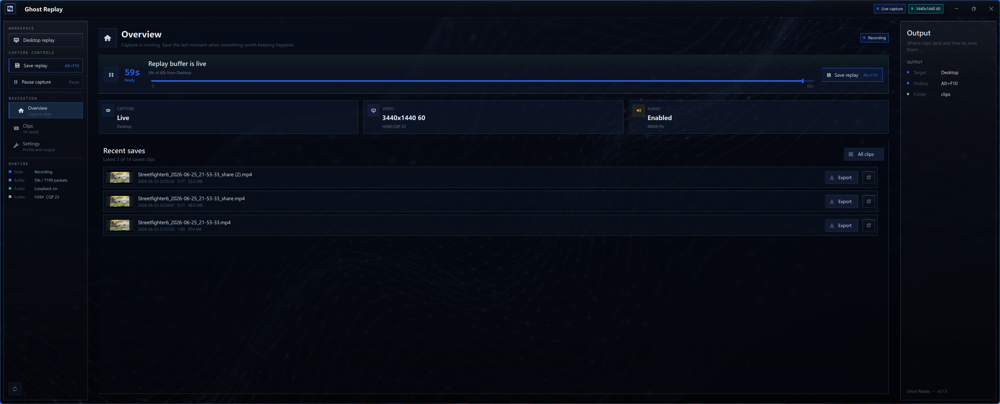
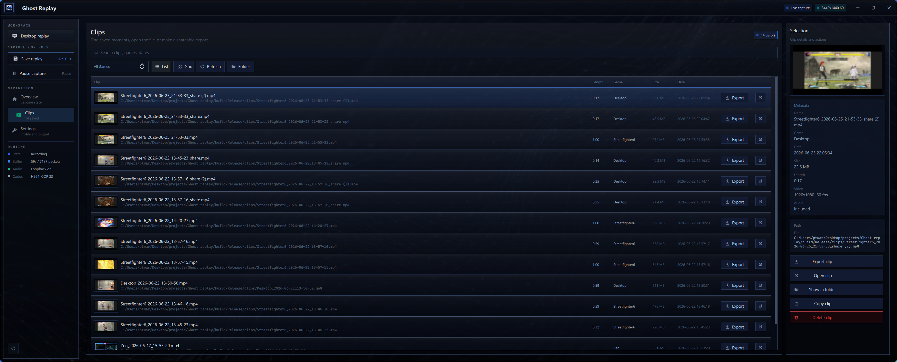
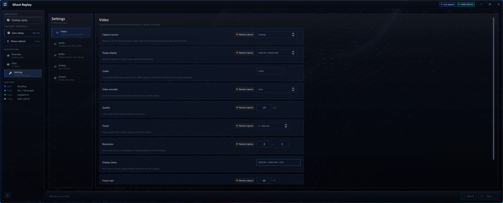

# Ghost Replay

**Instant-replay recording for Windows.** Save the last few seconds of your desktop, window, or game the moment something worth keeping happens — no OBS, no always-on stream required.

[](https://github.com/Confetti3/ghostreplay/releases/tag/v0.1.0)
[](https://github.com/Confetti3/ghostreplay)
[](LICENSE)

---

## Screenshots

**Overview** — live capture status, replay buffer, and recent saves at a glance.



**Clips** — your full clip library with search, game filter, thumbnails, and one-click export.



**Settings** — configure capture source, codec, quality, hotkeys, and output folder.



---

## Features

- **Rolling replay buffer** — always recording the last N seconds (configurable); press a hotkey to keep the clip
- **Desktop, window, or game capture** — uses the Windows graphics stack with no hooks or drivers required
- **WASAPI loopback audio** — captures system audio alongside video automatically
- **H.264 encoding** — hardware-accelerated encoding via the best available encoder on your GPU
- **Clip browser** — browse, preview, search, and filter your library by game or date
- **Shareable exports** — FFmpeg-based trimming and re-encode for smaller share-ready files
- **System tray integration** — runs quietly in the background; show or exit from the tray menu
- **No telemetry** — records locally, never uploads anything, no accounts required

---

## Requirements

| Component | Version |
|-----------|---------|
| Windows   | 10 1903 or newer |
| Visual Studio | 2022 with MSVC C++20 |
| CMake     | 3.25 or newer |
| Qt 6      | Core, Widgets, Quick, QuickControls2, QuickDialogs2, Multimedia |
| FFmpeg    | Shared LGPL-compatible dev build (include, lib, runtime DLLs) |

> **Note:** Run CMake builds from a **Visual Studio Developer PowerShell** or **x64 Native Tools Command Prompt** so deployment tools can locate the MSVC runtime.

---

## Build

```powershell
cmake -S . -B build -G "Visual Studio 17 2022" -A x64 `
  -DQT6_DIR="C:\Qt\6.x.x\msvc2022_64" `
  -DFFMPEG_DIR="C:\ffmpeg"

cmake --build build --config Release
```

If `nlohmann_json` or Catch2 are already installed with CMake package files, Ghost Replay uses those. Otherwise CMake fetches the pinned versions listed in [docs/THIRD_PARTY_NOTICES.md](docs/THIRD_PARTY_NOTICES.md).

### Run Tests

```powershell
cmake --build build --config Release --target ghostreplay_tests
ctest --test-dir build -C Release --output-on-failure
```

---

## Run

```powershell
build\Release\ghostreplay.exe
```

The app writes settings to `ghostreplay.json`, logs to `ghostreplay.log`, and clips to the `clips` folder — all relative to the executable. Closing the window hides the app to the tray; use the tray menu to show it again or exit fully.

---

## Package a Portable Release

```powershell
cmake --build build --config Release --target package_portable
```

This stages `dist\GhostReplay-<version>-win64-portable` and validates the bundled `ffmpeg.exe` for LGPL compliance before completing. Release packages use [config/ghostreplay.example.json](config/ghostreplay.example.json) for clean public defaults.

See [docs/RELEASE_CHECKLIST.md](docs/RELEASE_CHECKLIST.md) before publishing a public release.

---

## Troubleshooting

| Problem | Solution |
|---------|----------|
| Capture not starting | Check Overview for diagnostics; retry capture to open the Windows picker |
| Save hotkey conflicts | Reassign in Settings → Hotkeys and save |
| Clips folder not writable | Change the output path in Settings → Output |
| HEVC unavailable | Intentionally disabled in this beta until muxing is fully validated |

---

## Privacy & Security

Ghost Replay records and stores data **locally only**. It includes no telemetry, cloud upload, accounts, or analytics. See [SECURITY.md](SECURITY.md) for the vulnerability reporting process.

---

## UI Assets & Licenses

The Qt/QML interface bundles **Inter** and **Space Grotesk** from Google Fonts, both under the SIL Open Font License. See [docs/THIRD_PARTY_NOTICES.md](docs/THIRD_PARTY_NOTICES.md) and `resources/fonts` for full attribution.

---

## Contributing

See [CONTRIBUTING.md](CONTRIBUTING.md) for guidelines on bug reports, pull requests, and the development workflow.
